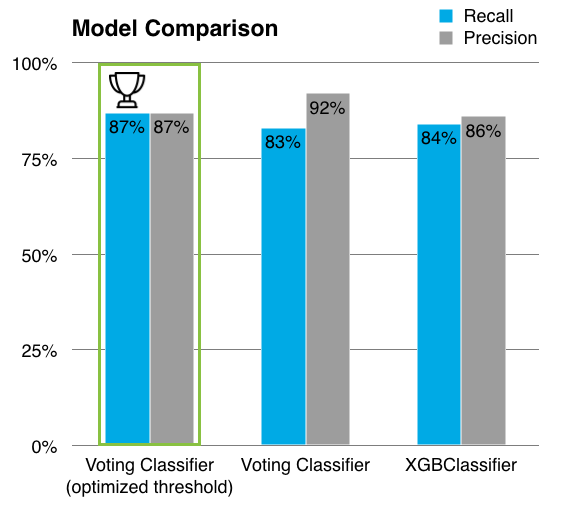

# Churn Prevention


**Project Team:**  
Kevin Tomas, Chandrakantha Hassan Anantharajaiah, Sebastian Rötten, Michael Leder


**Project Plan:**  
Project Start: 23/11/2020  
Project End  : 18/12/2020


**Business case:**  
The task is to perform a churn prediction based on the data available, to identify potential customers who would churn.This prediction helps in understanding the underlying reasons for churn and helps prevent the subscribers from churning with proactive approach (special offers, E-mails etc) to tackel issues leading to cancellations. 
 

**Business overview:**  
This project is carried out in cooperation with *'Die Zeit'*. *'Die Zeit'* is a german newspaper traditionally published on a weekly basis by *'Zeitverlag'* group. Their print media portfolio is not left untouched by the digitalization, over the time they changed their business model and added a digital channel to reach out to their readers with the possibility of easy and flexibly subscribing. To make this project possible *'Die Zeit'* provided us with dataset with details about their subscription and cancellation details. 


**Goal:**  
* Build a machine learning model to make better predictions than the model available with *'die Zeitverlag'* .  
* Recommend our stakeholder on how to retain those potential churn customers by **customer individual churn prevention mailing** and **special offers**.  
* Avoid sending unnecessarry emails to customers who are loyal, thereby preventing them from cancelling their subscription. 


**Dataset overview:**  
The original dataset contains  
- 209,043 observations (rows) and 170 features (columns).  
- subscription details since 2012 onwards (subscriptions of 'ZEIT' and 'ZEIT DIGITAL').


**Technologies and Methods used:**  
Preprocessing (EDA, Cleaning), supervised ML models (Naive Bayes, Logistic Regression, Randomforest, KNN, XGBoost and Voting classifier), advanced methods consisting of Deep Neural Network (DNN).


**Requirements:**  
condamini or conda  
or pyenv with Python: 3.8.5  
Jupyter notebook  


**Set up environment:**  
Run the following command in the terminal to setup the environment to be used

```bash
conda env create -f capstone_zeit_environment.yml
```

**Evaluation Metric:**  
* Recall: to identify as many real subscription churns as possible  
* Precision: to avoid disturbing loyal customers with unnecessary mails


**Usage:**

In order to train the model and predict the metric scores on test dataset

```bash
python Churn_prediction.py  
```

**Recommendations and findings:**  
We recommend to our stakeholders to contact the customers 10 month after the subscription for the first time and then every 12 month. This recommendation is based on the feature “vertragsdauer” and its distribution.

Overall we were able achieve model accuracy of by 87% in recall and 87% in precision and would recommend to use a voting classifier with optimized threshold for predictions.





**Future Work:**  
- Predictive model deployment to production  
- Detailed error analysis


